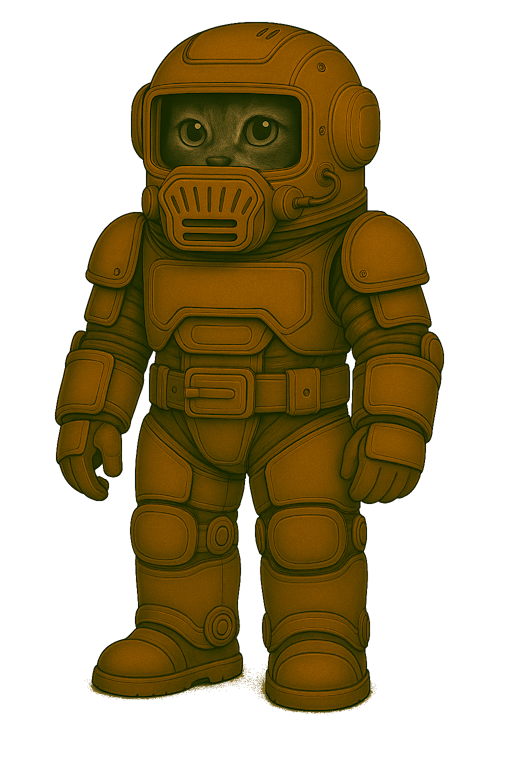
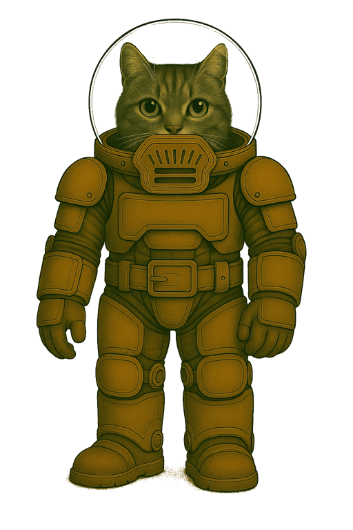

## Ausseneinsatzanzug der Bodentruppen – Typ GLx-03P

🧾 **Ausrüstungseintrag**

| Artikel-ID    | Bemerkung                                                          |
|---------------|--------------------------------------------------------------------|
| GLA-2000003P  | Bodentruppen · Kleidung · Ausseneinsatzanzug, gepanzert             |
| GLS-2000502   | Bodentruppen · Kleidung · Stiefel                                  |
| GLH-2000303C  | Bodentruppen · Kleidung · Helm, Kommunikation integriert           |
| UAX-6010101IR | Universal · Atemsystem · Filtermodul, IN-kompatibel, regenerierbar |

🏷️ **Gebrauchsbezeichnung**: Anzug GLx-03P
🗣️ **Spitzname in der Truppe**: PR03 (Platten-Rüstung)

🎯 **Verwendung**

- Ausseneinsätze unter mittleren Belastungsbedingungen
- Kontrollgänge, Stationssicherung, Materialtransport
- Ausbildungsbetrieb mit Bewegungsschwerpunkt
- Einsätze bis ca. 10 Stunden Betriebsdauer mit einer Standardkassette Typ S

📄 **Allgemeines**

Der Ausseneinsatzanzug GLx-03P die gepanzerte Standardkonfiguration der regulären Bodentruppen.
Er wurde für felinische Träger entwickelt, ist nicht IN-kompatibel, bietet aber hohe Bewegungsfreiheit, kombinierte Schutzwirkung und modulare Anschlussstellen.
Der GLx-03P befindet sich weiterhin im aktiven Truppeneinsatz und ist rückwärtskompatibel zu älteren Modulen.

Der GLx-03P wird derzeit nach und nach durch den verbesserten Nachfolger GLx-04P in der Truppe ersetzt.

🛠️ **Material und Aufbau**

#### Anzug (GLA-2000003P)
**Gewebematerial**:
PMF-55 – PolyMars-Flex®
Schutzklasse: 2–3 · rotationsfähig · plattenträgerkompatibel
**Eigenschaften**:

- Thermoausgleichend
- Innenfutter stossdämpfend, druckverteilend, atmungsaktiv
- Aussenschicht: scheuerresistent, staubabweisend, leicht elastisch
    **Farbgebung**: einfarbig Mars-Terrakotta (staubreduzierend, dienstlich genormt)

**Konstruktionsmerkmale**:

- Zweiteiliger Aufbau mit rotationsfähigem Bajonettverschluss
- Kreisdrehgelenk im Taillenbereich, abgedeckt durch taktischen Gürtel
- Belastungszonen elastisch gedämpft
- Verwendung mit Helm GLH-2000303C über Standardanschluss
- Notverwendung mit Kadettenhelm CLH-1000301 möglich – jedoch ohne Kommunikationsfähigkeit
- Integriertes Filtersystem mit folgenden Merkmalen:
    – Integriertes Filtermodul im Helmkragen zur Aufnahme der Standardkassette Typ S (UAX-6010101I)
    – IN-kompatibel · systemübergreifend einsetzbar bei allen Nicht-Elite-Systemen
    – Direkte Verbindung zur Kommunikationsschnittstelle des Anzugs
    – Werksseitig integriertes Mikrofonmodul mit Rauschunterdrückung
    – Schnellverschlusskappe mit mikrofonsichernder Führung, mit direktem Zugriff zum werkzeuglosen Austausch
    – Verbindung zum Truppenfunksystem über Standard-Klinke

**Panzerung**:

* PNT-4 – PlasTitan-Standard®
* Schutzklasse: 5 · stossverteilend · kugelhemmend · splitterschutzfähig
* Fest verbaut an: Brust, Rücken, Schultern, Oberschenkeln, Knien, Unterarmen
* Farbgebung: Mars-Terrakotta
* Wartung: Panzerplatten modular austauschbar durch Instandsetzung

#### Stiefel (GLS-2000502)

* Material: STX-55 – StepTex-Standard®
* Schutzklasse: 2–3 · Flexibilität: gut · Profilhaftung: hoch
* Halbhoch, mit Gelenkunterstützung
* Rutschhemmende Anti-Staub-Sohle
* robust

#### Helm (GLH-2000303C)

* Material: HSR-5 – HelmShell-Regular®
* Visier: SIL-7 – Silicorit-Sichtscheibe
* Schutzklasse: 4
* Kommunikation integriert (Suffix C
* Lautsprecher und PTT-Knopf extern im Anschlusskabel zum Funksystem integriert – Mikrofonanschluss erfolgt über Standard-Klinke am Filtermodul
* Belüftung überarbeitet, Innenpolsterung neu
* Kein HUD oder IN-System

#### Einsatzprofil

**Geeignet für**:

- Bewegungslastige Ausseneinsätze auf der Marsoberfläche
- Marsstationen, Patrouillen, Ausbildung unter Feldbedingungen
- Topografieeinsätze
- Ausbildungs- und Übungssituationen marsweit, auch mehrtägig

**Nicht empfohlen für**:

- Orbitaleinsätze, EVA, Hochrisikozonen
- Biologisch oder chemisch belastete Zonen

🔍 **Besonderheiten**

- Nicht IN-kompatibel (ausser Filterschnittstelle)
- Seriennummernregistrierung aller Hauptkomponenten
- Rückwärtskompatibel mit GLx-02P und Kadettenhelm CLH-1000301
- Modular aufrüstbar über Gurtträger und Schulterhalterungen
- UAX-6010101I: IN-kompatibel, mikrofonintegriert, nicht regenerierbar
- Vollständige taktische Integration mit Gurten, Packs und Kommunikationsausrüstung
