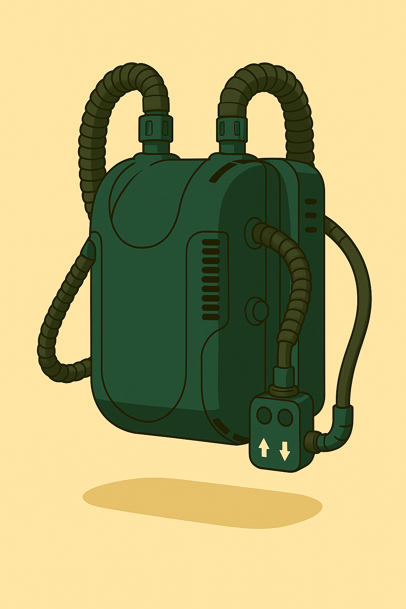

### Atemgerät für Tiefen-Scuba

Dieses Atemgerät basiert auf einem Kreislauf. Man nennt es auch "Kreislauftauchgerät".
Ein Kreislauftauchgerät oder Kreislaufatemgerät reinigt die ausgeatmete Luft, um diese danach wieder mit Sauerstoff anzureichern.
Dies ermöglicht lange Tauchgänge, denn weniger Atemgas wird verbraucht.

