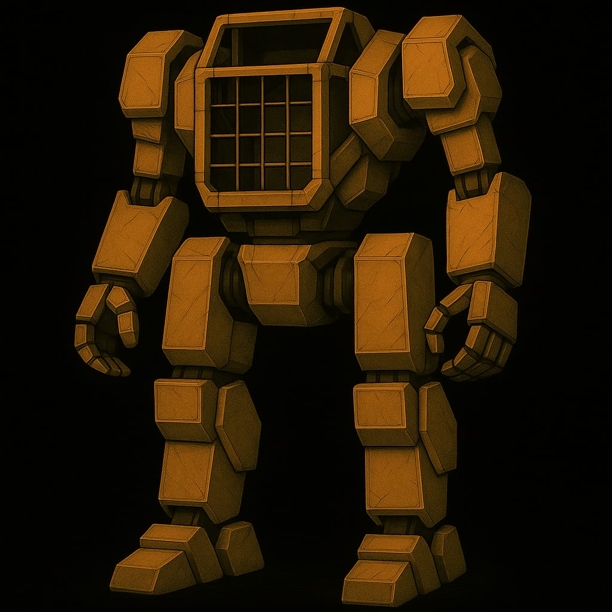

# Technologien

## Hebroboto

 Ein Arbeitgerät in Form eines Exoskeletts. Es gibt sie in verschiedenen Grössen, je nach auszuführender Arbeit und wie s

## Fernunterhalt

## Barriere-Schiffe

## Nicht-Schiff / Unwahrscheinlichkeits-Tarnung

## Modularfaust

Die Modularfaust ist eine Abschussvorrichtung üfr Granaten. Es ist eine ziemlich grosse Kiste auf ssechs Rädern bzw. mit Kettenantrieb.

Besonderheit:

* Tarnvorrichtung basierend auf einem Nachtigallerator
* Gleichwarmanlage stellt sicher, dass keine Temperatursignaturen zu finden sind

## Nachtigallerator

* verwackelt die Atome eines Gegenstands, mit dem er Kontakt hat => der Gegenstand wird unsichtbar
* basiert auf Unwahrscheinlichkeits-Technologie

## Entkörperungs-Technologie

## Unwahrscheinlichkeits-Bombe

Geht auf Pluto nieder, Axolotl befallen massiv die Plutonier

## Baumschiff
