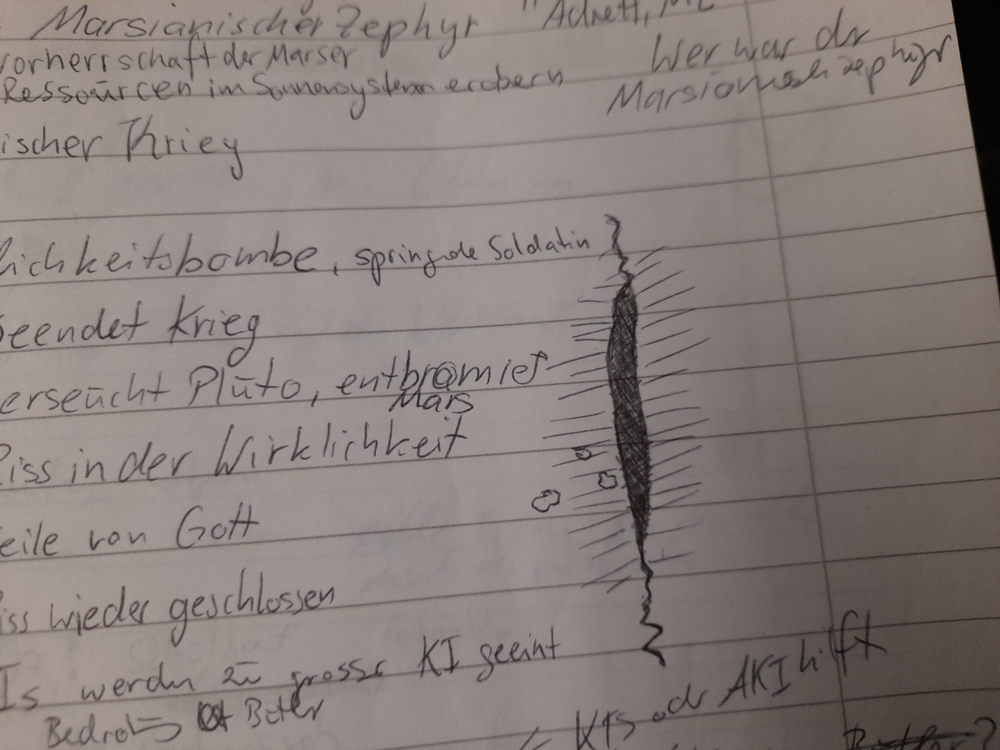
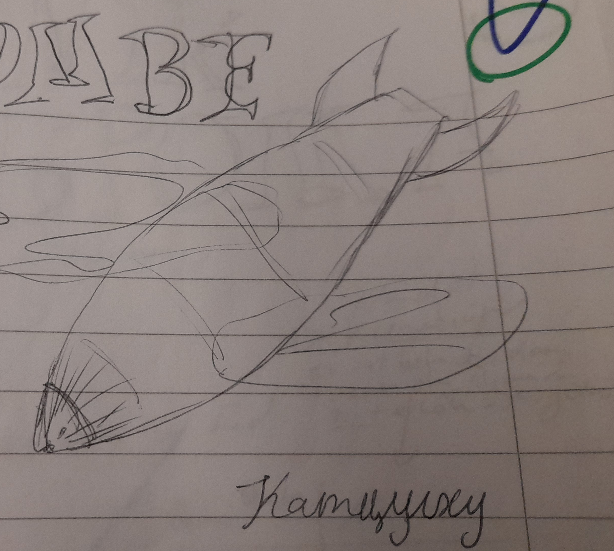

# Weltgeschehen - Timeline

## 1623 Landung des Grossen Schyffs

Das Grosse Schyff, so sagt zumindest die marsianische Geschichtsschreibung, landet auf dem Mars. Grundlegende
Ansiedlungen werdem gegründet, gigantische Planetoformanlage (PFA) erbaut, die das schädliche Brom des Mars aus der
Atmisphäre filtern. Sie werden von KI servittiert, die in einem grossen Werk hetgestellt werden. Was mit dem Schyff
weiter passiert ist, ist unbekannt. Die Felinen jedoch leben fortan auf dem Mars, *noch* mit Anzug.

Wie und woher das Schyff kam, ist den heutigen Felinen vergessen gegangen. In der Tat waren es KI, welche das grosse
Schyff besiedelten. Admiralin Ubika landete mit einem Raumschiff an. An Bord befand sich auch eine Lebensform, welche
Ubika auf Terra sehr lieb gewonnen hatte. Eine Katze.

Leider lebte die trächtige Katze nicht lange auf dem Mars. Sie starb an einer Bromvergiftung. Ubika war untröstlich und
sich ihrer Fahrlässigkeit bewusst.

Sie liess aus der DNA der Katze eine neue Lebensform zusammensetzen: einen Felinen. Immer noch empfindlich gegen Brom,
aber ausgestattet mit genug Witz. Ubika ordnete für ihre neue Rasse auch die Errichtung der Planetoformanlagen an.
Feline und KI lebten glücklich in einer Symbiose zusammen.

## 1990 Neith-Bau

Bei dem Versuch lunarer Raumingenieure, auf der Venus neuen Lebensraum zu schaffen, wird versehentlich eine
Raum-Zeit-Spalte zu einer anderen Dimension geöffnet. Durch den Riss gelangen Raummolche und eine Wolke Gottesstaub in
das Sonnensystem. Seither haben die Dreifinger die göttliche Gabe der Gegenwartsbrechung. Brom-Handelsbeziehungen haben
gestartet.

## 1993 Anlandung Barbisches Baumschiff auf Neith

Unbeabsichtigt gerufen durch den Neith-Unfall landet eine barbische Vorhut mit einem Baumschiff im Sonnensystem an. Die
Barben sind zunächst der Überzeugung, dass sie gerufen wurden und siedeln sich kurzer Hand auf dem neuen Venusmond Neith
an.

## 2003 Anlandung Barbisches Baumschiff auf dem Mars

Eine Unterströmung der Barben landete auf dem Mars. Am Bord eine grosse Menge orange-katholischer Gläubiger. Diese waren
vollkommen entsetzt über die Zustande auf dem Mars.

Nur "richtiges" Leben ist erlaubt. KI ist Häresie und daher verboten. Die Glaubensrichtung greift schnell um sich und
die orangekatholische Gruppierung stellt eine Truppe auf die Beine, welche KI mit Hass und Nachdruck verfolgt. Dies
gipfelt in der Machtergreifung des sogenannten Marsianischen Zephirs und dem Zweiten Interplanetarischen Krieg.

## 2012 Erster Planetarischer Krieg

Gebiets- beziehungsweise Planetenstreitigkeiten durch die neue Spezies der Barben und Gebietsansprüche.

Die Planeten werden verteilt und ein Nichtangriffspakt geschlossen. DIe Barben bekommen einzig und allein Neith.

## 2033 Machtergreifung Marsianischer Zephir

Ein Politiker, der als Marsianischer Zephir bezeichnet wird, kommt an die Macht. Er verspricht den Marsern ein besseres
Leben unter marsianischer Herrschaft. Denn der Marsiaischen Verherrschaft würden die Ressourcen im Sonnensystem
zustehen. Bereits jugendliche Marser werden in Jugendgruppen indoktriniert bei den sogenannten MZ-Kadetten.

Alle KI werden in Lagern verpflichtet. Die Fabrik wird stillgelegt. Nach und nach werden die überflüssigen KI
entpersonalisiert oder komplett zerstört.

## 2034 Beginn Zweiter Interplanetarische Krieg

Der Marsianische Zephir fingiert einen terranen? Angriff auf den Mars. Im weiteren Verlauf werden immer mehr Planeten
mit in den Konflikt hineingezogen, bis das ganze Sonnenystem daran beteiligt ist - und sogar dieBarben von Proxima
Zentauri.

## 2045 Kriegsende dank UW-Bombe

Die Barben möchten den Krieg beenden. Während der Mars schon ergeben har, kämpfen seine Verbünderen, die Plutonier,
immer weiter. Aus Verzweiflung und Neugier greifen sie den Pluto mit einer neu entwickelten Bombe an, die auf der sog.
Unwahrscheinlichkeits-Technologie beruht. Dabei wird erneut ein Riss zu der Dimension Gottes erzeugt, diesmal aber so
gross, dass einige kleine Splitter, aber auch eine riesige Scherbe Gottes in das Sonnensystem stürzt.

Zumindest ist das die offizielle Version. Inoffiziell jedoch hätte die Bombe den Mars zerstören sollen. Jedoch hat eine
Marser Soldatin zu verhindern gewusst, indem sie die Bombe aus Nands Vorgarten zum Pluto teleportierte.

**Folgen**

* Grosse Teile Plutos sind von Unwahrscheinlichkeit verseucht.
* Gottesscherben fliehen zum Mars.
* Mars wird entbromiert
* KIs werden bei PFA überflüssig und stehen zum Wiederaufbau zur Verfügung

Darüber hinaus werden die KI-Lager entdeckt. Die Grausamkeiten wefden erkannt und die Ersten Roboter-Gesetze formuliert,
welche dem Schutz aller KI dient.

## 2045 Der Letzte Bromsturz

Nach dem Niedergang der Scherbe Gottes kommt es, aufgrund der Bromgier des Splitters, zu einem gewaltigen Bromsturz.
Sämtliches Brom wird zum Grossen Bromdelta gezogen. Diese Gegend wird dadurch noch unwirtlicher und man hört komische
Dinge von dort.

## 2045 Angriff auf Bromsal

Gelegenheit macht Diebe. Nand beobachtet den Vakuumierungsangriff auf Bromsal. Am nächsten Morgen transportieren sie
Tante Marys Leiche zum Friedberg (XVIII). Nand ist wieder im LT-Tunnel, der beängstigend vibriert. Schliesslich wacht er
aus dem Traum auf und stellt fest, dass die Vibrationen real sind. Luftangriff auf Bromsal. Die Wohnbleibe der Familie
liegt ausserhalb der Stadt. Daher geht Nand hinaus, um alles zu beobachten (curiosity kills the cat). Die Bunkerlampen
brennen und schalten auf rot. Die fünf Schiffe erschaffen eine Barriere um Bromsal herum und vakuumieren die Stadt.
Ausserdem kleine Vakuumierungsbomben, auch Richtung Hof. Am nächsten Morgen gehen Nand, Halo und seine Mutter nach
Bromsal, um nach Tante Mary zu sehen. Bromsal ist ziemlich zerstört, sie finden Tante Mary tot und fahren sie mit einer
Sacke zum Friedberg. Sie bahren die Tote in der Heroldshalle auf.

## 2045 Schiff Ganymed

Das letzte Schiff mit Marser Soldaten kann vom Ganymed fliehen. An Bord des Frachters sind versehrte Soldaten. Sie
landen etwas später auf dem Mars an.

## 2045 Unwahrscheinlichkeitesbombe (sprengt Pluto)

Die Bombe explodiert den Pluto, reisst ein Loch ins Raum-Zeit-Gefüge bzw. die Gottes-Dimension und Scherben Gottes
regnen ins Sonnensystem.

## 2071 Der Heilige Krieg

Die Orange-Katholischen erstarken erneut. Grund ist u. a. die grosse Arbeitslosigkeit auf dem Mars. Dies wird auf die KI
zurückgeführt. Diese waren beim Wiederaufbau den Mars nützlich, nehmen jetzt allerdings Arbeitsplätze weg.

Diese Lehre ist beliebt, Denn sie formuliert klar die Vorherrschaft des Lebens gegenüber KI. Das Progom ist auf lange
Sicht geplant.

Als Ergebnis werden die 2. Robotergesetze legalisiert und KI in der Folge stregen Regelungen unterworfen:

* keine Persönlichkeit
* keine Stimmausgabe
* Unförmigkeit / Abnormität
* "Sie sei ein stummer Sklave deiner Hand."
* Die KI sind unglücklich.
